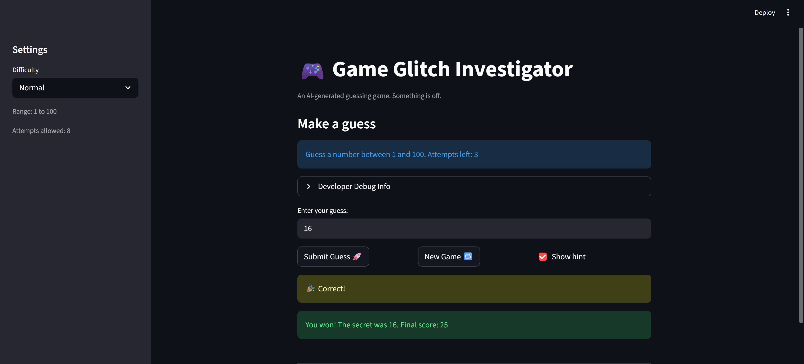

# 🎮 Game Glitch Investigator: The Impossible Guesser

## 🚨 The Situation

You asked an AI to build a simple "Number Guessing Game" using Streamlit.
It wrote the code, ran away, and now the game is unplayable.

- You can't win.
- The hints lie to you.
- The secret number seems to have commitment issues.

## 🛠️ Setup

1. Install dependencies: `pip install -r requirements.txt`
2. Run the broken app: `python -m streamlit run app.py`

## 🕵️‍♂️ Your Mission

1. **Play the game.** Open the "Developer Debug Info" tab in the app to see the secret number. Try to win.
2. **Find the State Bug.** Why does the secret number change every time you click "Submit"? Ask ChatGPT: _"How do I keep a variable from resetting in Streamlit when I click a button?"_
3. **Fix the Logic.** The hints ("Higher/Lower") are wrong. Fix them.
4. **Refactor & Test.** - Move the logic into `logic_utils.py`.
   - Run `pytest` in your terminal.
   - Keep fixing until all tests pass!

## 📝 Document Your Experience

- [x] **Game Purpose:** A number guessing game built with Streamlit where players guess a secret number within a specified range (1–20 for Easy, 1–100 for Normal, 1–50 for Hard). The game provides hints ("Too High" or "Too Low"), tracks attempts and score, and declares a win or loss based on correct guesses or attempt limits (6, 8, or 5 respectively).

- [x] **Bugs Found:**
  1. **Inverted hint logic** – The comparison operators in `check_guess()` were reversed. When a guess was greater than the secret, it said "Go LOWER" (correct message) but returned "Too High" inconsistently with the hint. When a guess was less than the secret, it said "Go HIGHER" but the logic was backwards, causing players to receive opposite guidance.
  2. **New Game button didn't work after losing/winning** – The game status remained "won" or "lost", so clicking "New Game" still showed the "Game over" message instead of resetting to playable state.
  3. **Invalid guesses counted as attempts** – When players entered non-numbers or empty strings, the attempt counter incremented before validation, wasting attempts without a valid guess.
  4. **Game state wasn't fully reset** – Only the attempt counter and secret number reset on "New Game"; score and history persisted, preventing clean replays.

- [x] **Fixes Applied:**
  1. **Corrected inverted hint logic** – Fixed the comparison operators in `check_guess()` in `logic_utils.py` so that when `guess > secret`, it correctly returns "Too High" with message "Go LOWER", and when `guess < secret`, it returns "Too Low" with message "Go HIGHER". This eliminated the backwards guidance that was trapping players in impossible win conditions.
  2. **Complete state reset on New Game** – Added `st.session_state.status = "playing"`, `st.session_state.score = 0`, and `st.session_state.history = []` to fully reset the game state, eliminating the stuck "game over" condition.
  3. **Validate before counting attempts** – Moved `st.session_state.attempts += 1` into the validation success block so only _valid_ guesses consume an attempt. Invalid input now shows an error without affecting the attempt counter.
  4. **Preserved existing test suite** – Changes maintained the core logic, ensuring all 3 pytest tests pass.

## 📸 Demo

- [ ] [Insert a screenshot of your fixed, winning game here]
      

## 🚀 Stretch Features

- [ ] [If you choose to complete Challenge 4, insert a screenshot of your Enhanced Game UI here]
